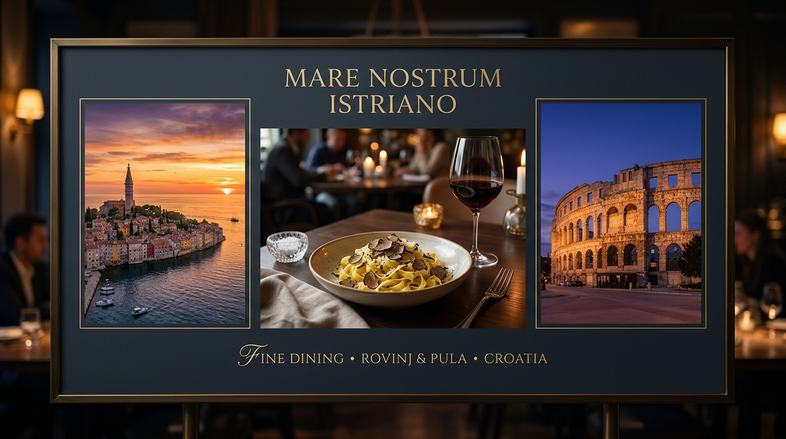

# IstraDine AI: Gastronomy Meets Intelligence

## The Vision
**IstraDine** is not just a restaurant app; it's a digital bridge between thousands of years of Istrian tradition and the cutting edge of Artificial Intelligence. Inspired by the rugged beauty of the Adriatic coast and the sophisticated flavors of the peninsula, IstraDine serves as a "Digital Trubadur" for the modern guest.

Whether you are seeking the Venetian elegance of **Rovinj** or the Roman grandeur of **Pula**, IstraDine ensures that your Istrian journey is seamless, personalized, and unforgettable.

---

## Core Functions

### 📍 Dual-Location Intelligence
Seamlessly switch between our two flagship locations. The entire app—from the menu to the ambient imagery and AI background knowledge—reconfigures itself to match the soul of your chosen city.

### 🤖 Gemini-Powered AI Concierge
Our custom-tuned AI assistant doesn't just answer questions; it understands the nuance of Istrian hospitality.
- **Personalized Recommendations:** Pairs the perfect Malvazija with your Boškarin steak.
- **Dietary Safeguard:** Real-time allergen tracking and menu filtering.
- **Local Context:** Asks you "Do you like truffles?" while suggesting events in the Pula Arena or Rovinj's Old Town.

### 💳 Guaranteed Booking & Pre-payment
To ensure the highest quality of service and solve the "no-show" problem, IstraDine features a high-trust reservation system:
- **Table Selection:** Choose between Terrace View, Inner Hall, or VIP sectors.
- **Duration Management:** Automatic 120-minute slot allocation for optimal flow.
- **Pre-payment Gateway:** Integrated payment security ensures every booking is a committed dining experience.

### 🎭 Visual Soirée Calendar
A curated list of musical and cultural events. From Jazz Thursdays to Romantic Piano Fridays, the app provides a visual window into the evening's atmosphere.

---

## Technology Stack

- **Frontend:** React 18, Vite, Tailwind CSS, Framer Motion (for "IstraTech" fluid interactions).
- **Backend:** Express.js (Node.js).
- **Intelligence:** Google Gemini AI (Vertex AI/GenAI SDK).
- **Icons:** Lucide-React.
- **Design System:** Serif-led "Istrian Modern" aesthetic with Playfair Display and Inter.

---

## Future Roadmap

### 🏰 Visual Floor Mapping
Interactive 3D maps of the restaurants allowing guests to pick their specific table—whether it's "Table 4 with the sunset view" in Rovinj or "Table 12 by the arches" in Pula.

### 🎙️ Multi-Language Voice AI
Expanding the concierge to include real-time voice translation and ordering for international guests visiting from Italy, Germany, and beyond.

### 🌿 Farm-to-Table Traceability
Integrating blockchain or verified local data to show exactly which Istrian forest your truffle came from or which vineyard produced your bottle of Teran.

### 🎁 Loyalty NFT Rewards
A digital passport system where dining at both locations unlocks "Gold Tier" IstraDine status and exclusive invitations to future Soirées.

---

*Prepared by Istra Tech Development Team.*
